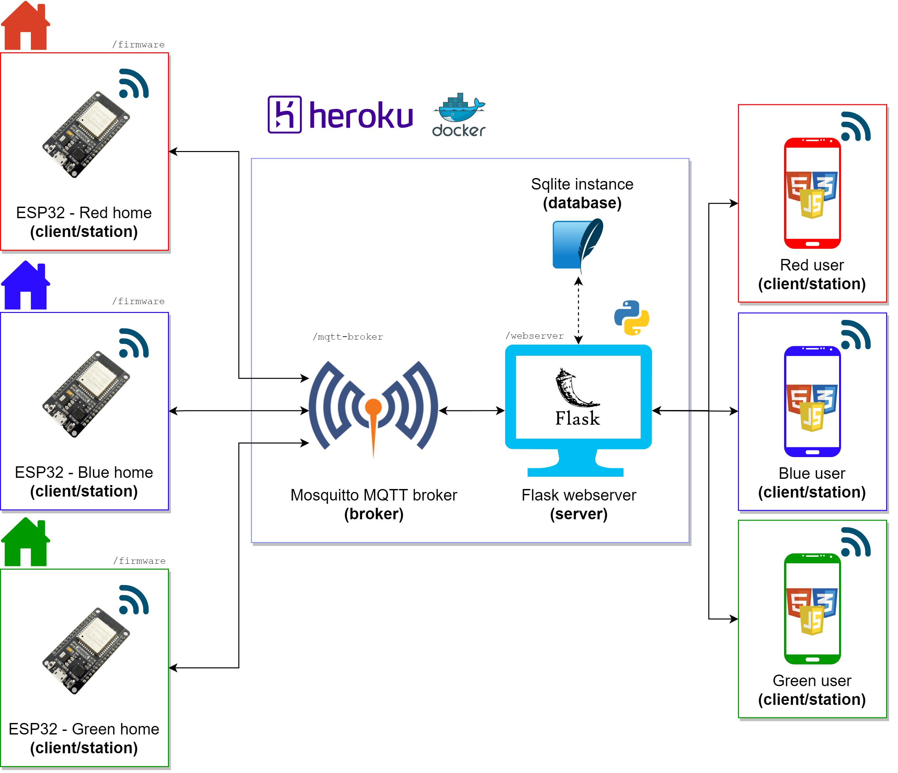
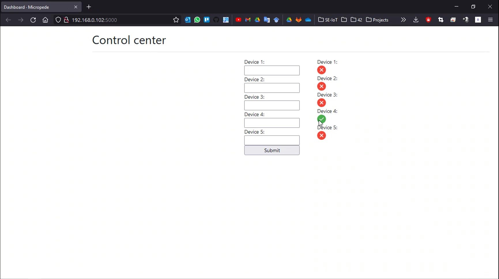
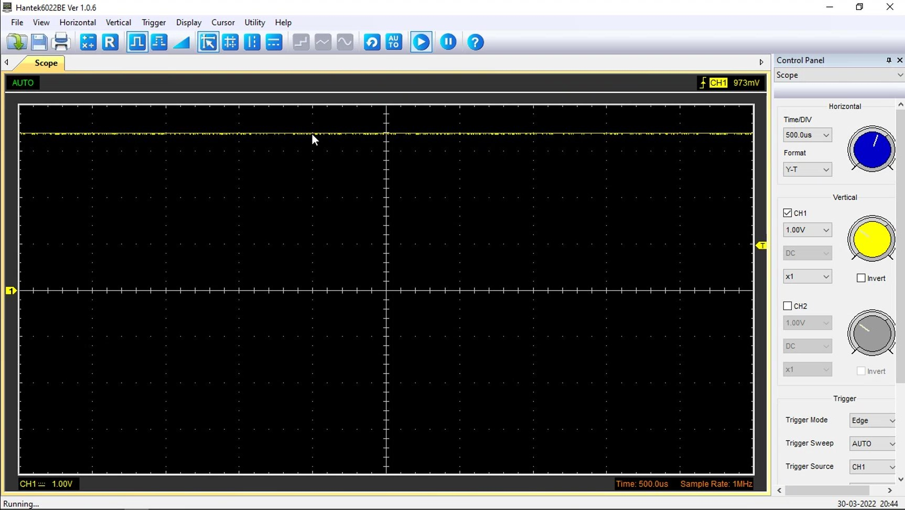

---
title:
- Trabalho final 2 - Aplicação para IoT
author:
- Levy G. S. Galvão
- Pedro H. S. F. Santos
language: pt-BR
numbersections: true
output:
    pdf_document:
        template: NULL
        toc: true
---

<!-- sudo apt-get install pandoc -->
<!-- pandoc report.md -o report.pdf -->

# Especificação do projeto

O presente trabalho, entitulado de aplicação para IoT, tem o objetivo de desenvolver uma interface homem-máquina utilizando Flask, que permitirá o controle de funções de Liga/Desliga de equipamentos de casa. Essa interface é acessada em um navegador por uma segunda máquina. O microcontrolador utilizado foi o ESP32, e para verificar a saída do mesmo, foi utilizado um osciloscópio digital.

 

Figura 1 - Arquitetura proposta inicialmente para o projeto.

# Módulos utilizados na aplicação

Para o desenvolvimento do firmware, foram utilizados os módulos do ESP-IDF, a interface oficial para o ESP32, as bibliotecas de Wi-Fi para que fosse realizada a conexão sem fio e do MQTT, para que fosse possível se conectar ao servidor broker. Para a interface homem-máquina, foi utilizado o framework Flask, juntando com uma dependência que é o Flask-MQTT, que facilitava a criação de um cliente MQTT em Python.

# Diretórios do sistema

Os diretórios do sistema foram separados em três, um para todo o firmware, outro para a configuração do servidor MQTT, que acabou não sendo utilizada e o último para a criação do webserver com o Flask.

O firmware é separado em três arquivos, o `main.c`, `wifi.c` e `mqtt.c`. O arquivo `wifi.c` configura e tenta manter a conectividade com o Wi-Fi disponível, tentando se reconectar sempre que ocorrer alguma queda. O arquivo `mqtt.c` faz a conexão com o servidor MQTT broker, se subscrevendo nos tópicos, recebendo e enviando mensagens e acionando as GPIOs quando solicitado na mensagem. O arquivo `main.c` é responsável pela configuração dos GPIOs e inicialização das funções de Wi-Fi e MQTT.

O servidor MQTT pensado inicialmente foi o Mosquitto broker, mas por dificuldades na hora de subir para o heroku, acabou por se utilizar o HiveMQ, um broker público, que pode ser utilizado por qualquer pessoa, por isso inviável para aplicações profissionais.

Por último, o webserver com Flask foi pensado de várias formas, mas acabou sendo um arquivo .py e outro .html. É formado por alguns forms no html onde são escritos "on" ou "off" e enviados ao servidor. Ao lado há imagens que identificam se o comando foi alterado ou não. O arquivo .py tem as funções para subscrever no tópico, enviar mensagens e tratar as mensagens recebidas.

 

Figura 2 - Aplicação do Flask.

Para os testes, foi ultilizado um osciloscópio digital para verificar os sinais de saída do ESP32. Na figura a seguir é possível ver a saída em nível lógico alto após o acionamento usando o Flask.

 

Figura 3 - Osciloscópio mostrando saída do pino em nível alto após acionamento no Flask.

# Conclusão

O desenvolvimento do projeto IoT permitiu compreender a aplicação que poderia ser utilizado para automação residencial, para acionamento de lampadas, recebimento de dados de sensores, entre outras opções que poderiam se encaixar.

Por fim, apesar do projeto ser simples, este possui grande representatividade em futuros projetos profissionais, pois foram utilizados ferramentas que são utilizadas no desenvolver de várias funcionalidades, em firmwares, no back-end ou front-end.
