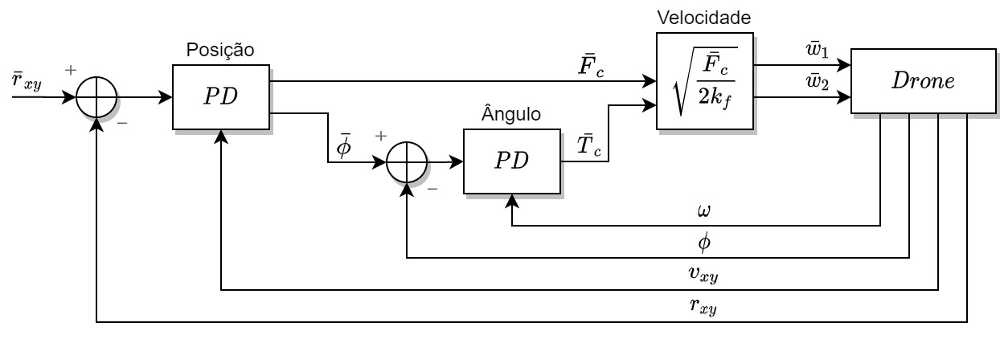
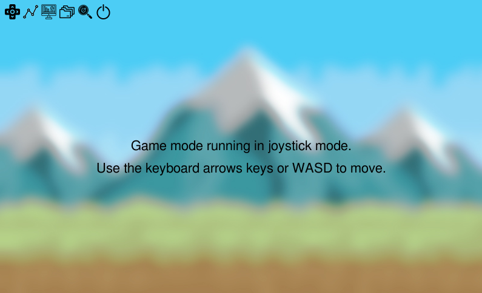
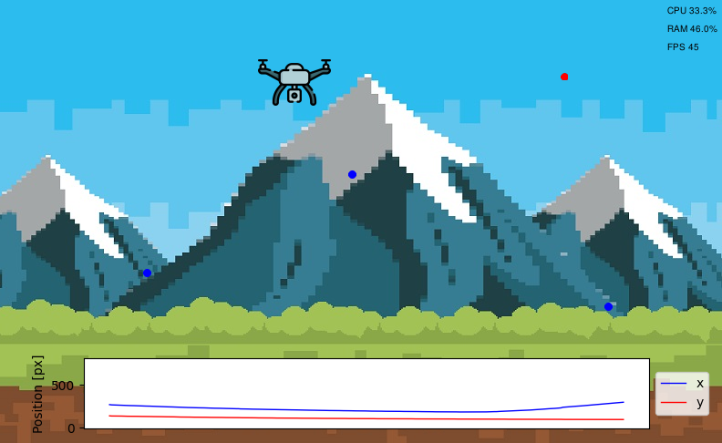

---
title:
- Trabalho final 1 - Simulação de um drone 2D
author:
- Levy G. S. Galvão
- Pedro H. S. F. Santos
language: pt-BR
numbersections: true
output:
    pdf_document:
        template: NULL
        toc: true
---

<!-- sudo apt-get install pandoc -->
<!-- pandoc report.md -o report.pdf -->

# Especificação do projeto

O presente trabalho, entitulado de projeto de simulação do drone ou projeto do drone, de forma curta, tem o objetivo de desenvolver uma simulação aplicando numericamente os conceitos físicos que envolvem a cinemática e dinâmica de um drone, ou qualquer *unmanned aerial vehicle* (UAV) com eixo de propulsão vertical. 

Também pretende-se implementar um sistema de controle de posição para que o drone ajuste suas variáveis internas com o objetivo de alcançar um destino especificado. 

A simulação deve ser feita por meio de um jogo 2D em linguagem `Python` e esta aplicação deve permitir que o drone seja movimentado pelas setas dos teclado, ou por meio do estabelecimento de pontos de destino que, após serem dispostos na tela da aplicação, o drone deverá definir sua trajetória para alcançar todos os pontos de acordo com a ordem estabelecida.

Para auxiliar o gerenciamento da simulação, a aplicação deve conter uma interface gráfica capaz de:

- Selecionar o modo em que a simulação irá operar, seja movimentando o drone por meio de setas no teclado ou por meio de pontos de destino estabelecidos por coordenadas cartesianas da tela ou pelo clique do mouse;
- Possuir botões para ativar o modo de depuração que permite observar os pontos de destino com clareza e destinção da ordem com que o drone irá perserguir, no caso do modo com pontos de destino e o mesmo conjunto de botões pode permitir observar o ponto de destino modificável pelas setas, no caso do modo de movimentação por setas no teclado;
- Ativar ou desativar painel com informações de depuração, e.g. taxa atual de frames, porcentagem de consumo da CPU, porcentagem de consumo da memória RAM;
- Permitir plots em tempo real da evolução das variáveis de estado e/ou exportação em um arquivo textual, e.g. `.csv` ou `.txt`.


# Módulos utilizados na aplicação

Para auxiliar o desenvolvimento da aplicação em `Python`, alguns módulos ou bibliotecas foram utilizados. A biblioteca `Pygame` foi utilizada no desenvolvimento das mecânicas do jogo e para o desenvolvimento da interface gráfica entre homem e máquina que permitiu o gerenciamento da aplicação, incluindo seleção dos seus modos de operação e apresentação de informações do interesse do usuário. A biblioteca `Numpy` foi utlizada nos cálculos extensivos com vetores e demais operações algébricas que culminaram no funcionamento das simulações físicas e do sistema de controle. A biblioteca `psutil` foi utilizada para extrair informações acerca do desempenho da CPU e da memória RAM durante o tempo de execução para apresentar ao usuário por meio da interface gráfica. A biblioteca `Matplotlib` foi utilizada para mostrar *plots* das curvas de posição do drone em tempo real na interface gráfica.

# Integração do sistema

## Árvore de diretórios

Abaixo observa-se a árvore de diretórios que compõe o projeto do drone. Nela pode-se observar a divisão do aplicativo nos diretórios `/data`, `/gui_utils`, `/img` e `/sprites`, além do pasta raiz `/game`.

```
game
 |-- data
 | |- .gitignore
 | |- data.csv
 |-- gui_utils
 | |- Button.py
 | |- GUI.py
 |-- img
 | |- images...
 |-- sprites
 | |- Background.py
 | |- Drone.py
 | |- Waypoint.py
 |-- game.py
 |-- requirements.txt
```

De acordo com os diretórios, cada um guarda uma função específica:

- `/game` é o diretório raiz da aplicação e este contém todos os outros diretórios, o *script* principal de execução da simulação do drone e um arquivo de `requirements.txt` indicando as versões das bibliotecas em Python utilizadas para esta aplicação;
- `/sprites` contém as classes para as principais *sprites* utilizadas na simulação, estas são: `Background` para definir as telas de fundo do jogo e da interface com o usuário; `Waypoint` para definir a movimentação, colisão e visualização dos pontos de destino utilizados na simulação; e `Drone` contendo detalhes da cinemática e dinâmica do drone de acordo com as leis físicas e o sistema de controle interno de posição;
- `/img` contém todas as imagens utilizadas na aplicação, estas envolvendo plano de fundo, *sprites* e botões;
- `/gui_utils` contém as classes utilizadas para montar a interface gráfica interativa com o usuário, estas são: `Button` para gerar os botões e seu gerenciamento; e `GUI` que encompassa a totalidade dos botões utilizados na interface e demais gerenciamento da interface;
- `/data` é um diretório destinado a armazenar os arquivos `.csv` exportados pela aplicação e que contém dados relacionados às variáveis de estado do drone.

## Drone

No desenvolvimento do drone, inicilamente foram levadas em conta as mecânicas básicas inierentes a uma *sprite*, como: gerenciamento de colisões; acervo de imagens para a *sprite* escolher sendo, basicamente duas, que auxiliam na ilusão do giro dos rotores do drone; escalação da imagem das *sprites* para o tamanho adequado.

Inicialmente o drone possuirá métodos para sua movimentação com as setas do teclado ou WASD e com simples mecânica de gravidade e inércia para uma noção básica de como este se comportaria. Posteriormente, estas mecânicas foram substituídas pelas equações dinâmicas do movimento do drone que leva em conta parâmetros físicos pré-determinados.

Para isto, o código do drone foi alterado para que sua movimentação dependece da solução dessas equações da dinâmica, portanto implementando por meio da solução de um sistema de equações diferença no espaço de estados o sistema que representa o drone, recebendo comandos de velocidade para ambos os rotores e desenvolvendo uma velocidade linear bidimensional, velocidade dos rotores, ângulo de ataque, velocidade angular e, principalmente, uma determinada posição bidimensional variante no tempo, como variáveis de estado.

Feita a alteração, a variação da posição do drone torna-se dependente da velocidade de giro dos rotores que deve ser controlada pelo usuário, porém esta se configura como uma árdua tarefa, uma vez que este deve se manter ciente, mesmo que indiretamente, das variáveis de estado. 

Portanto o desenvolvimento do sistema de controle foi uma etapa essencial para implementar a movimentação do drone por meio das setas do teclado ou WASD ou por pontos de destino, pois este permite que o usuário não mais entre com as velocidades dos rotores, mas sim com um valor de posição bidimensional de referência.

O propósito geral do sistema de controle é realizar o controle de posição, mas esta depende de outras etapas de controle prévias, estas são: controle de posição, controle do ângulo de ataque e, finalmente o controle das velocidades dos rotores, que resulta nos comandos de velocidade para o drone.

A figura 1 mostra em detalhes o funcionamento do sistema de controle. Este se vale de dois controladores proporciona-derivativo, um para o controle da posição bidimensional e outro para o controle de ângulo. Ambos os controladores recebem suas respectivas variáveis de estado diretamente lidas do drone para que o erro seja computado. 

<center> 

Figura 1 - Diagrama do sistema de controle.


</center>

O controle de posição retorna a referência de ângulo para o controle de ângulo e a força de controle para que, em conjunto com a referência de torque gerado pelo controle de ângulo, gerem as referências de velocidade para os rotores.

Em relação às rotinas de código em `Python` a dinâmica do drone e o sistema de controle foi implementado diretamente como métodos da classe `Drone` como partes constituíntes do objeto físico drone.

Para solução das equações diferenças foi utilizado o método Runge-Kutta de ordem 4 e com passo de integração de $2.5ms$ e a rotina de controle atuou em passos de $10ms$. 

O jogo foi executado a $50$ FPS, ou seja, o seu *loop* de execução é repetido a cada $20ms$. Isso significa que a cada frame a rotina de controle é executada duas vezes ($20ms/10ms$) e a atualização do drone é realizada oito vezes ($20ms/2.5ms$).

Para movimentação do drone, o usuário tem acesso ao método `track` que permite que uma posição na tela seja oferecida e ela será roteada diretamente ao sistema de controle de posição para que esta seja alcançada em tempo hábil. 

Dessa forma, para controlar o drone com as setas do teclado ou WASD foi desenvolvido o objeto `Waypoint` que, possui movimentação pelo teclado, colisão e constitui-se de um ponto no espaço que pode ser indicado visualmente ou não e que se movimenta sem física aplicada, permitindo oferecer a posição de referência para que o drone siga. 

No caso da movimentação por pontos definidos pelo mouse, o mesmo `Waypoint` anteriormente explicado irá assumir sequencialmente as posição determinadas pelo usuário e alterará sua posição sempre que o controle de posição retornar um baixo erro de posição em relação ao ponto anteriormente definido.

## Interface gráfica com o usuário

<<<<<<< HEAD
A interface gráfica com as opções oferecidas pode ser acessada unicamente quando o usuário pausar o jogo por meio da tecla *escape*. Essa separação entre a interface e o jogo evita problemas de queda de frames durante a execução do jogo, mas a depender de uma boa otimização do código, torna-se apenas uma questão cosmética.

Ao acessar a tela de configuração da interface gráfica a figura 2 pode ser observada. A interface é bem minimalista e possui apenas 6 botões para implementar as funcionalidades descritas na seção de especificações. 

<center> 

Figura 2 - Interface gráfica com o usuário minimalista.


</center>

Ainda cada botão da interface oferecerá uma descrição da sua funcionalidade ao passar o *mouse* por cima, permitindo total compreensão.

Obedecendo a sequência da esquerda para a direita, cada botão tem a seguinte funcionalidade:

1. Alterar entre o modo *joystick* e o modo *waypoint*;
2. Habilitar *plot* das variáveis de estado ao longo do tempo (na versão atual preocupa-se apenas em mostrar a posição bidimensional);
3. Apresenta na tela dados analíticos sobre CPU, RAM e FPS;
4. Habilita escrita das variáveis de estado em um arquivo `.csv`;
5. Habilitar o modo de depuração que mostra indicação colorida para os pontos de destino;
6. Finaliza a aplicação.

Abaixo na figura 3 observa-se o jogo funcionando em modo *waypoint* e com todas as funcionalidades da GUI ligadas.

<center> 

Figura 3 - Aplicação funcionando com todas as funcionalidades da GUI.


</center>

No canto inferior da tela, fora dos limites de colisão (abaixo da terra) é mostrado o *plot* de evolução da posição ao longo do tempo de execução e em tempo real; No canto superiro direito são mostrados os dados acerca de consumo de CPU, RAM e taxa de FPS atual; Na tela, o ponto vermelho é o ponto atual de destino do drone e os pontos azuis os próximos a serem rastreados.

# Conclusão

O desenvolvimento do projeto do drone permitiu compreender a aplicação em tempo real de um sistema de controle, bem como as formas de depuração ineretes ao processo, como: fatores de desempenho do sistema e variação das variáveis de estado;

A aplicação em forma de jogo permitiu o acesso simples e caseiro a um drone, permitindo o discente se interar sobre a física por trás desse tipo de veículo.

Por fim, apesar do projeto ser simples, este possui grande representatividade em futuros projetos profissionais, pois como este se configura como uma simulação, a aplicação real não divergirá significativamente, pelo menos falando em relação ao projeto do sistema de controle e dos algoritmos a serem usados no *firmware* de um possível drone.
=======
A interface gráfica é dividida em duas classes apenas, a classe Button, que cria um objeto de botão, colocando as cores passadas, posicionamento, mudanças que podem acontecer no momento do clique, entre outras funções. Já a classe GUI tem uma função mais geral, utilizando a classe Button para criar seus vários botões e posicioná-los, com alguns labels para cada botão, sendo eles `mode`, `plot`, `analytics`, `csv`, `debug` e `power`. O botão `mode` serve par alterar o modo de jogo entre `joystick` e `waypoint`, o botão `plot` expõe as variáveis de estado do sistema do drone, enquanto o botão `csv` exporta-os para um arquivo `.csv`. O botão debug destaca o waypoint para se ter conhecimento em para onde o drone estará indo e o botão `analytics` plota na tela a performance do jogo na máquina. Por último, o botão `power` desliga a aplicação.
Dentro do jogo, depois que o objeto GUI é criado, sempre é verificado se algum label do botão foi alterado para atualizar as funções no jogo.

# Referências sobre conceitos extras
>>>>>>> 430037700efc9f30e9e691ff7a6c3f620a97f3a1
